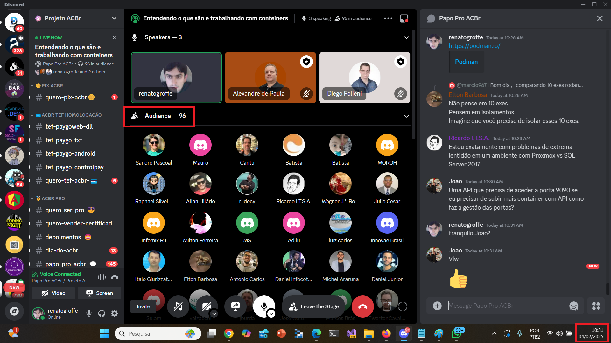
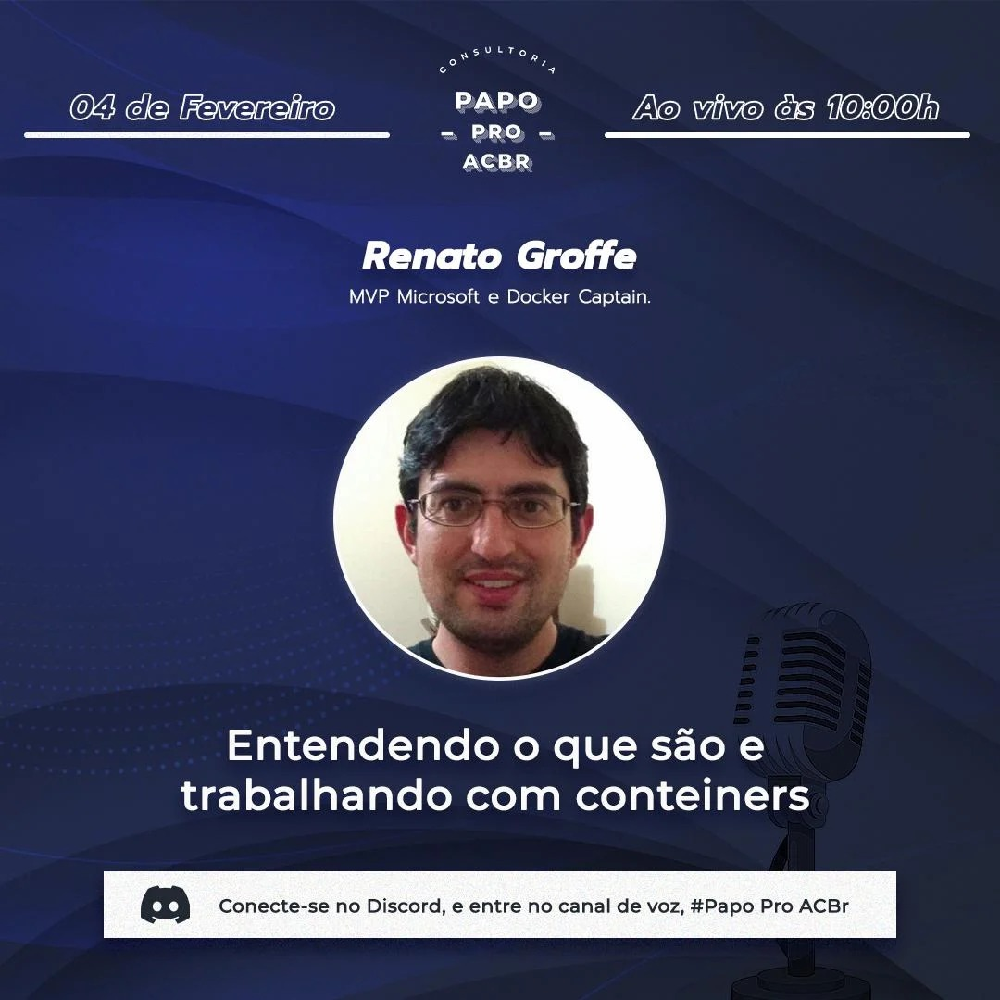
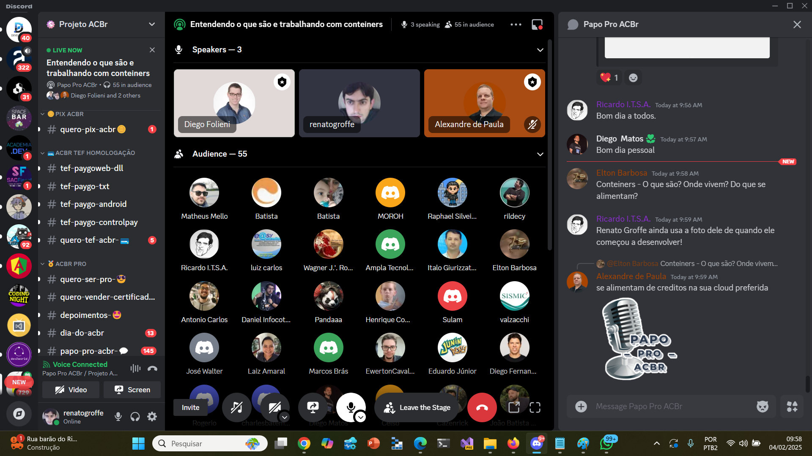
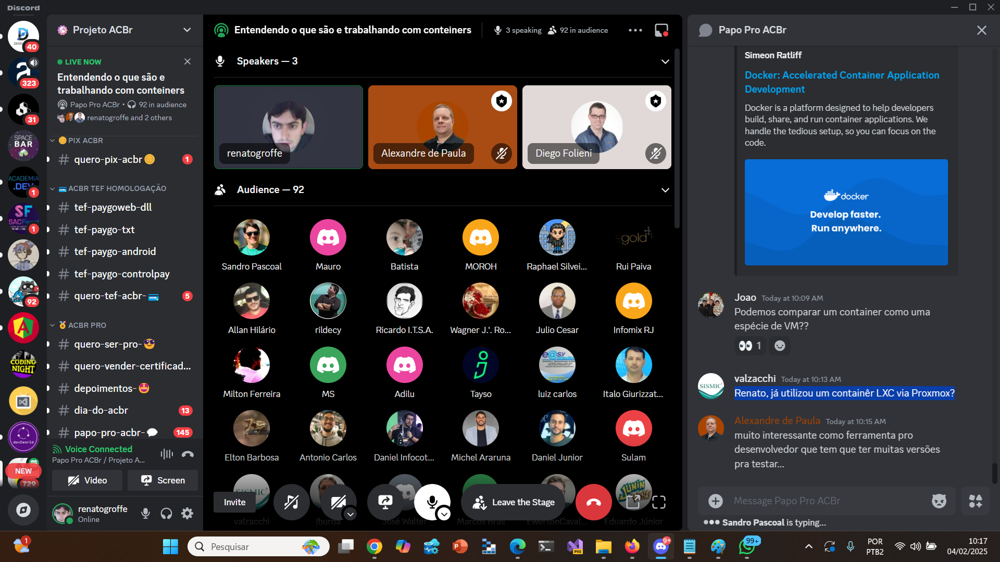
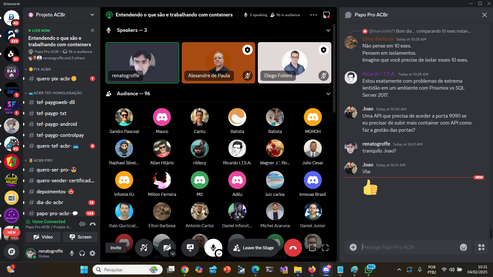
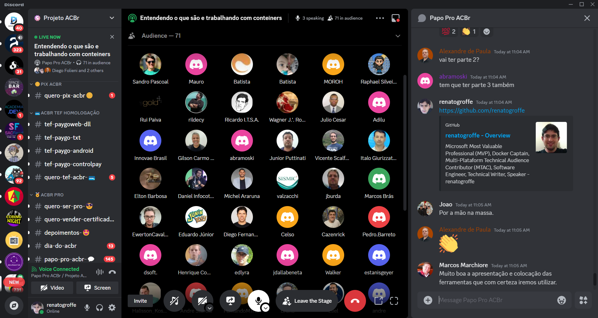

# Containers_ACBr-2024-02
Materiais de apoio sobre Containers para a talk que realizei para a comunidade ACBr no dia 04/02/2025.

Título da apresentação: **Entendendo o que são e trabalhando com containers**

Data: **04/02/2025 (terça-feira)**

Tipo do evento: **Online**

Ferramenta de transmissão: **Discord**

Tecnologias utilizadas: **Docker, Docker Compose, Linux, Kubernetes, OpenTelemetry, Jaeger, Grafana, PostgreSQL, MySQL, .NET, ASP.NET Core, Java, Node.js, Python...**

Número de participantes: **96 pessoas (pico de audiência ao longo da live)**

Link do evento: [**Instagram**](https://www.instagram.com/p/DFn3rXnTF3X/)

Gravação da talk: [**Spotify**](https://open.spotify.com/episode/5OVA7T51jx8SPOBguUFUAS?si=01356a7c995643d3)

Deixo aqui meus agradecimentos ao amigo **Alexandre de Paula** pelo convite, ao **Diego Folieni** que foi o host do evento e às dezenas de membros da comunidade **Projeto ACBr** que acompanharam o evento durante uma manhã de terça-feira (04/02/2025).

Outros prints podem ser encontrados neste [**diretório**](/img/).

---

